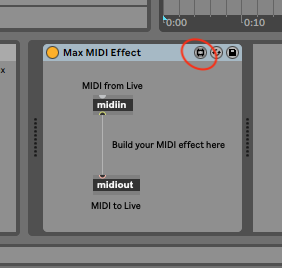

# min.midiout

This project arose out of frustration with Ableton Live's lack of reasonable preview/auditioning functionality for MIDI clips. If you preview a MIDI clip in the library browser it will either use a silly sine wave sound, or, if there was a device on the track the MIDI clip was created on, it will use that device to play back the notes in the MIDI clip. There is no way you could have the MIDI sent to a MIDI port, for instance to preview the clips on an external synth.

Reportedly it can also be used on with the internal Midi bus on Mac by enabling the IAC driver and creating custom bus, then using that bus as the output.

Be warned: it is quite a disgusting hack, to be honest, but it works for me, and I'm sharing it in case someone else might find it useful.

## Prerequisites

⚠️ Only builds on Mac OS, and only tested on Catalina (reportedly it's working on Monterey, too), Ableton Live Suite 10 and 11 (Max4Live is required)

ℹ️ These instructions assume you're somewhat familiar with the Terminal.

First and foremost, you need [Homebrew](https://brew.sh/) installed for all the build tools (compiler, git etc.). You could install the Apple developer tools by other means, and get git from other distros, but my instructions assume Homebrew is present.

Then install `cmake`:

```
$ brew install cmake 
```

## Build

Clone the repository, create the build directory, and build the `min.midiout` Max external:

```
$ git clone https://github.com/samsta/min.midiout.git --recursive
$ mkdir min.midiout/build
$ cd min.midiout/build
$ cmake ..
$ make
```

## Install

First, copy the external in a safe location so you could delete the build directory, or even the whole `min.midiout` checkout, if you wanted to. Let's drop it in a directory with the Ableton User Library:

```
$ mkdir $HOME/Music/Ableton/User\ Library/Externals
$ cp -a min.midiout.mxo $HOME/Music/Ableton/User\ Library/Externals/
```

Open the directory, you'll need it in a few minutes.

```
$ open $HOME/Music/Ableton/User\ Library/Externals/
```

In Live, on an otherwise empty MIDI track, add a Max MIDI Effect from the browser on the righthand side of the screen (Max for Live, Max MIDI Effect, Max MIDI Effect), then click on the Edit button (circled red in the following image):



This will open up a Max editor window. Delete everything apart from the `midiin` block. This will look like this:


Now drag the `min.midiout.mxo` from the Finder window we've opened earlier into the Max editor. Open the Max Console, you'll likely find an error in there saying something along the lines of _newobj * /Users/sam/Music/Ableton/User: No such object_ which is because it doesn't like the space in the path. Fix that by adding double quotes to the path in the box you've just added to the editor:


You'll notice another error saying _Need a MIDI port name_. Find the MIDI port you want in one of the lines starting with _Enumerating:_, in my case `Unitor8/AMT8: Port 1` is what I want. Add that text, again surrounded with double quotes, to the box in the editor. If Max is happy with what you've entered, the box will no longer be highlighted, and you'll see a message in the console saying _min.midiout: Found what we were looking for!_. Now connect the `midiin`'s output to the `min.midiout`'s input:


Now click the lock in the bottom left corner, and then save the device, for instance as `MidiPreHear`, in the default location the save dialog suggests.

Now play some notes on the MIDI channel you've added the device to, but make sure you've set _MIDI To_ to _No Output_ on the channel as we want to make sure the Max device is taking care of MIDI out. If you can hear the notes on the external synth connected to the MIDI output you chose in the Max editor, you're good to close the Max editor.

Now click the _save_ icon on the Max device (circled red in the following image):


You'll see a file `MidiPreHear.adv` pop up in the browser on the left. Now it's time to copy this deep into the guts of Live. Find your Live application in the finder, then right-click and select _Show Package Contents_. Navigate to `Contents/App-Resources/Misc` and rename the file `MidiPreHear.adv` to `MidiPreHear.adv.bak` to create a backup. You might have guessed by now: we're going to replace that file with the one we just created. Drag it from the browser in Live into that `Misc` folder you've just navigated to. The result should look something like this:


If all went well, you should now be able to preview MIDI clips using the output you've just added.

## Notes

I am perfectly happy with a hard-coded output as I'm always going to use the same MIDI port. If you need anything beyond that, you're on your own, sorry. But with a bit of programming knowledge, everything should be figure-out-able.

And: Shame on you, Ableton, for not providing this useful and often-asked-for piece of functionality!


